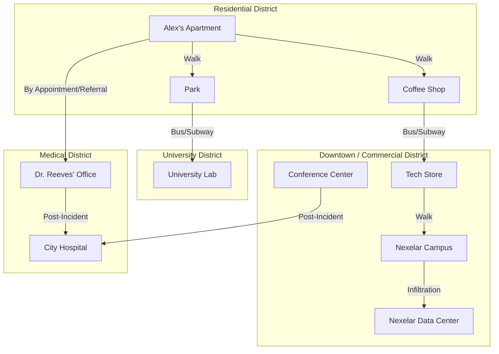

# City Map and Scene Layout
## Navigable Areas and Key Scene Locations

This document outlines the key districts and locations in the city where the events of "Quantum State" unfold. The city is designed to be a modern urban environment with distinct districts that reflect different aspects of Alex's life.

### City Overview

The city is a sprawling metropolis with a vibrant tech sector, quiet residential areas, and academic institutions. The layout is designed to support the narrative, with locations clustered into logical districts.

---

### 1. Residential District (Alex's Neighborhood)

This is where Alex spends most of his time, serving as the primary "reality anchor" for the player. It's a mix of residential buildings, small businesses, and public spaces.

#### Key Locations:

*   **Alex's Apartment Building**:
    *   **Description**: A modest, slightly dated apartment building. Alex's apartment is cluttered with computers, scientific journals, and whiteboards covered in equations.
    *   **Scenes**: This is the central hub for the player. It's where Alex works on personal projects, experiences the onset of many delusions, and has moments of lucidity. It serves as the starting point for most episodes.

*   **Local Coffee Shop**:
    *   **Description**: A cozy, modern coffee shop with public Wi-Fi that Alex frequents.
    *   **Scenes**:
        *   **Episode 1**: Alex uses the "noisy" Wi-Fi to hide from perceived surveillance and has a paranoid conversation with Carlos, the barista.

*   **Public Park**:
    *   **Description**: A small city park with benches, walking paths, and open green spaces.
    *   **Scenes**:
        *   **Episode 2**: Alex practices his "reality-altering abilities," believing he can manipulate the environment away from electronic interference.

---

### 2. Downtown / Commercial District

The bustling heart of the city's tech industry. It's characterized by modern skyscrapers, corporate campuses, and retail stores. This area represents Alex's past professional life and the source of some of his delusions.

#### Key Locations:

*   **Nexelar Corporate Campus**:
    *   **Description**: A large, high-tech campus for the company where Alex used to work. It includes office buildings and a secure data center.
    *   **Scenes**:
        *   **Episode 1**: The climax of the episode, where Alex infiltrates the campus and its data center, believing it's the source of the surveillance AI. He confronts his own past work here, leading to a moment of clarity.

*   **Tech Store**:
    *   **Description**: A generic but sleek electronics retail store.
    *   **Scenes**:
        *   **Episode 1**: Alex confronts his former colleague, Maya, accusing her of being part of the surveillance conspiracy.

*   **Conference Center**:
    *   **Description**: A large, modern venue for corporate and academic events.
    *   **Scenes**:
        *   **Episode 2**: Alex attends a quantum computing conference and attempts to demonstrate his "discoveries" on stage, leading to a public episode.

---

### 3. University District

A quieter area dominated by a large university campus, libraries, and student housing. It represents Alex's intellectual pursuits and his search for validation.

#### Key Locations:

*   **University Physics Laboratory**:
    *   **Description**: A state-of-the-art research lab filled with complex scientific equipment.
    *   **Scenes**:
        *   **Episode 2**: Alex sneaks into the lab to use the equipment to "prove" his theories on quantum consciousness and has a confrontation with Professor Elkins.

---

### 4. Medical District

This area contains the city's main hospital and various private clinics. For Alex, it's a place of both potential healing and vulnerability.

#### Key Locations:

*   **Dr. Reeves' Therapy Office**:
    *   **Description**: A calm, professional, and welcoming office in a private clinic building.
    *   **Scenes**:
        *   **Episode 1**: Alex tries to convince Dr. Reeves that the surveillance is real, revealing the depth of his delusion. These sessions act as narrative checkpoints.

*   **City Hospital**:
    *   **Description**: A modern hospital where Alex is taken after his public episode.
    *   **Scenes**:
        *   **Episode 2**: Alex wakes up in the hospital and has a conversation with Dr. Chen, who helps him begin to process what happened.

---

### ASCII Map Layouts

Here are a few different ASCII art representations of the city map.

#### Layout 1: District Quadrants

This layout shows the general geographic relationship between the city's districts.

```ascii
+-----------------------------------------------------------------+
|                                                                 |
|   +---------------------+      +--------------------------+     |
|   |  UNIVERSITY         |      |   DOWNTOWN / COMMERCIAL  |     |
|   |  DISTRICT           |      |   DISTRICT               |     |
|   |                     |      |                          |     |
|   |  - University Lab   |      |   - Nexelar Campus       |     |
|   +---------------------+      |   - Tech Store           |     |
|                                |   - Conference Center    |     |
|                                +--------------------------+     |
|                                                                 |
|                                                                 |
|   +---------------------+      +--------------------------+     |
|   |  RESIDENTIAL        |      |   MEDICAL DISTRICT       |     |
|   |  DISTRICT           |      |                          |     |
|   |                     |      |   - Therapy Office       |     |
|   |  - Alex's Apt       |      |   - City Hospital        |     |
|   |  - Coffee Shop      |      +--------------------------+     |
|   |  - Park             |                                       |
|   +---------------------+                                       |
|                                                                 |
+-----------------------------------------------------------------+
```

#### Layout 2: Simplified Street Map

This layout provides a more traditional map-like view with key locations marked.

```ascii
===============================================================================
| CITY MAP - QUANTUM STATE                                                    |
===============================================================================

                                 +----------------------+
                                 | UNIVERSITY DISTRICT  |
                                 | [U] Physics Lab      |
                                 +----------------------+
                                       |         |
                                    (Univ. Rd)   |
                                       |         |
   +-----------------------------+---- | --------+--------------------------+
   | RESIDENTIAL DISTRICT        |  (Main St)   | DOWNTOWN/COMMERCIAL      |
   |                             |              |                          |
   | [A] Alex's Apartment        |              | [N] Nexelar Campus       |
   | [C] Coffee Shop             |              | [T] Tech Store           |
   | [P] Park                    |              | [F] Conference Center    |
   +-----------------------------+              +--------------------------+
                                       |
                                    (South St)
                                       |
                                 +----------------------+
                                 | MEDICAL DISTRICT     |
                                 | [H] Hospital         |
                                 | [D] Dr. Reeves' Off. |
                                 +----------------------+

===============================================================================
```

#### Layout 3: Narrative Flow Diagram

This layout shows how Alex might move between locations based on the story's progression.



### Grid-Based City Map (512x512 Conceptual Grid)

This layout imagines the city on a 512x512 grid, providing a more structured placement for key locations. The ASCII map below is a simplified representation of this grid, with conceptual coordinates (X, Y) from the top-left corner.

For reference, Ecstatica has a 128x128 grid and LBA2 has 64x64, so this 512x512 grid allows for a more detailed layout while still being manageable.

**District Placement:**
*   **University District**: Top-Left Quadrant (0-255, 0-255)
*   **Downtown / Commercial District**: Top-Right Quadrant (256-511, 0-255)
*   **Residential District**: Bottom-Left Quadrant (0-255, 256-511)
*   **Medical District**: Bottom-Right Quadrant (256-511, 256-511)

```ascii
(0,0)                               (256,0)                             (511,0)
+-----------------------------------------------------------------------------+
| UNIVERSITY DISTRICT             | DOWNTOWN / COMMERCIAL DISTRICT            |
|                                 |                                           |
|      [U] Uni Lab (100, 80)      |            [F] Conf. Center (400, 50)     |
|                                 |                                           |
|================================= University Rd =============================|
|                                 |                                           |
|                                 |            [T] Tech Store (350, 180)      |
|                                 |                                           |
|                                 |            [N] Nexelar Campus (450, 200)  |
|                                 |                                           |
+--------------------------------- Main St -----------------------------------+ (511, 256)
| RESIDENTIAL DISTRICT            | MEDICAL DISTRICT                          |
|                                 |                                           |
|      [A] Alex's Apt (80, 300)   |            [D] Dr. Reeves' Off. (400, 320)|
|                                 |                                           |
|      [C] Coffee Shop (120, 350) |                                           |
|                                 |            [H] City Hospital (450, 400)   |
|      [P] Park (150, 450)        |                                           |
|                                 |                                           |
+-----------------------------------------------------------------------------+
(0,511)                             (256,511)                           (511,511)
```

#### Ideas
Generate with Gemini Imagen Preview


